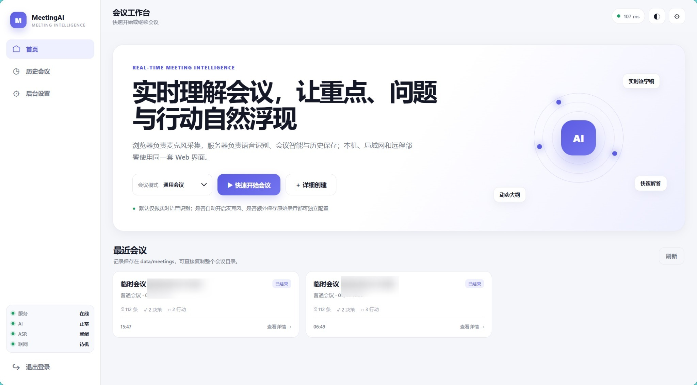
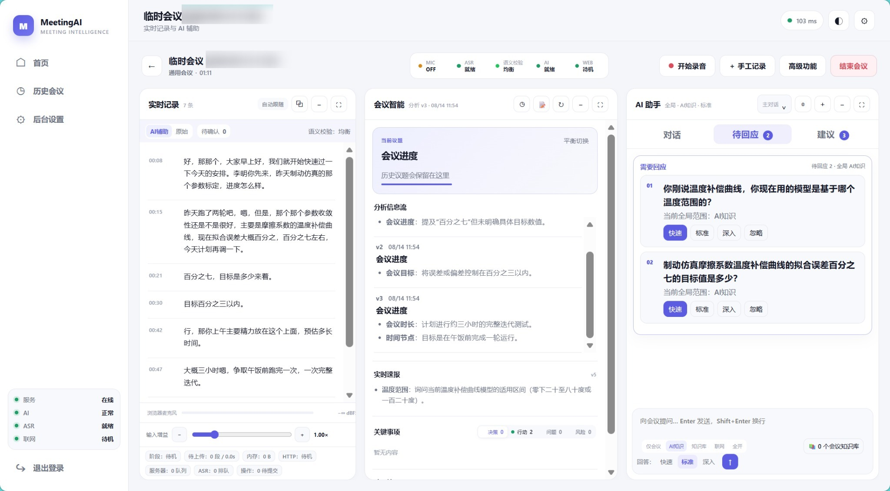
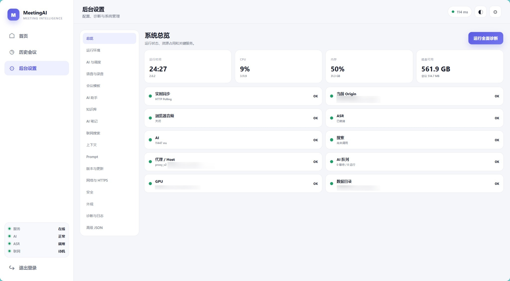

# MeetingAI Local

> **中文名：MeetingAI 本地会议智能助手**  
> **English name: MeetingAI Local — Local-first Meeting Intelligence**

**中文描述：** 本地优先的实时会议智能助手，支持浏览器实时录音与转写、ASR 语义校验、会议洞察、问题雷达、AI 问答、AI 笔记、知识库增强，以及 MP3 等超长音频导入。  
**English description:** A local-first meeting intelligence assistant for real-time transcription, semantic ASR review, meeting insights, AI Q&A, notes, local knowledge, and long-audio import.

MeetingAI Local 是一个 Web-first、单文件 Python、自托管的会议工作台。浏览器负责麦克风采集，服务端负责 ASR、会议智能、历史保存与 AI 调度。它既可以处理正在进行的会议，也可以导入既有录音进行离线转写与分析。

> 当前公开版本：**v2.0.2** · Python **3.10+**

## Screenshots / 界面预览

### 会议工作台首页



### 实时会议工作区



### 后台与系统诊断



## 核心能力

- **实时会议转写**：浏览器麦克风 → HTTP 音频块 → ASR → 持久化逐字稿。
- **三栏会议工作台**：实时记录、会议智能、AI 助手并排工作，可折叠与专注放大。
- **会议智能**：当前议题、分析信息流、实时速报、决策、行动、问题、风险与阶段总结。
- **问题雷达**：识别会议中需要当前用户回应的问题，支持快速 / 标准 / 深入回答。
- **全局回答范围**：仅会议 / AI 知识 / 知识库 / 联网 / 全开，所有回答路径统一继承。
- **ASR 语义校验**：原始逐字稿不被 AI 修改；AI 语义标注独立写入 sidecar，可标记 `clean / corrected / uncertain / critical_uncertain`。
- **AI 辅助逐字稿**：原始 / AI 辅助视图切换，支持待确认中心与历史会议重新校验。
- **超长音频导入**：MP3、WAV、M4A、AAC、FLAC、OGG、OPUS、WEBM、MP4/MOV/MKV 音轨等，通过 FFmpeg 分段后台转写。
- **AI 笔记**：Markdown、表格、任务列表、历史版本与下载。
- **本地知识库**：TXT / MD 递归扫描、增量索引、可调 chunk / overlap / Top-K / 相似度。
- **运行环境管理**：CPU / GPU / CUDA / PyTorch / FFmpeg / 依赖检测，ASR 引擎和模型推荐、切换、预热。
- **中国大陆网络适配**：Pip 官方 / 清华 / 阿里云 / 中科大镜像、ModelScope / HuggingFace 镜像及按作用域代理。
- **弱网与恢复能力**：音频上传和轻量操作均有独立队列、幂等处理与重试。

## 数据设计：原始证据与 AI 理解分离

MeetingAI Local 不允许 AI 偷偷覆盖 ASR 原文：

```text
音频 / 麦克风
      ↓
     ASR
      ↓
transcript.jsonl          ← 原始逐字稿 / 不由 AI 改写
      ↓
AI 语义标注
      ↓
transcript_semantics.jsonl ← 独立解释层
      ↓
会议智能 / AI 助手 / AI 笔记 / 总结
```

高置信语义修正可以辅助后续理解；金额、数字、日期、负责人、合同条件和关键决策等事实使用更高置信门槛。语义标注失败时自动回退原始逐字稿，不阻塞会议主链。

## 快速开始

### 1. 准备环境

需要已安装：

- Python 3.10+
- 本地 ASR 或音频导入时建议安装 FFmpeg

MeetingAI **不会安装 Python 本体**。

### 2. 安装核心依赖

```bash
python -m pip install -r requirements.txt
```

国内网络可在 MeetingAI 后台配置 Pip 镜像和代理；也可以自行使用熟悉的镜像安装依赖。

### 3. 可选：安装本地 ASR

FunASR：

```bash
python -m pip install -r requirements-asr-funasr.txt
```

Faster-Whisper：

```bash
python -m pip install -r requirements-asr-whisper.txt
```

> GPU 用户请先安装与本机 CUDA / 驱动匹配的 PyTorch。MeetingAI 的运行环境页面会检测硬件并给出推荐，但不会强制覆盖用户选择。

### 4. 启动

```bash
python meetingai.py
```

默认 HTTP 端口为 `7777`。本机访问通常为：

```text
http://127.0.0.1:7777
```

首次运行会在程序目录创建 Web UI、Prompt、Schema、配置和数据目录，并生成首次登录密码文件 `FIRST_RUN_PASSWORD.txt`。

### 5. 自检

```bash
python meetingai.py --self-test
```

## 本地模型与 Provider

默认可连接本地 Ollama，也支持 OpenAI-compatible Provider。回答深度与知识范围互相独立：

- 回答深度：快速 / 标准 / 深入
- 回答范围：仅会议 / AI 知识 / 知识库 / 联网 / 全开

深入模式会根据 Provider 能力尽可能启用原生 reasoning / think；不支持时会显式退化为深入分析 Prompt。

## 超长音频导入

会议页面 → **高级功能 → 导入音频**。

设计为后台任务：

```text
文件上传 / 本地落盘
→ FFmpeg 探测与分段
→ ASR 队列
→ 时间轴合并
→ transcript
→ ASR 语义校验（可选）
→ 会议智能
```

上传和转写进度可以持久化；长录音不会要求把整个文件一次性载入内存。

## 运行环境与中国大陆镜像

后台 → **运行环境** 可检测：

- Python / CPU / 内存
- NVIDIA GPU / 显存
- CUDA / PyTorch CUDA
- FFmpeg
- MeetingAI 核心依赖与 ASR 依赖

支持：

- Pip：官方 / 清华 / 阿里云 / 中科大 / 自定义
- 模型：ModelScope / HuggingFace / 自定义 HF endpoint
- 代理：系统 / HTTP(S) / SOCKS5
- 代理作用域可区分依赖下载、模型下载与其他网络请求

## 安全与隐私

MeetingAI Local 是 **local-first**，但是否完全离线取决于你的配置：云端 AI Provider、联网搜索、依赖安装和模型下载都可能产生外部网络请求。

公开仓库中请**绝对不要提交**：

```text
config.json
secrets.json
FIRST_RUN_PASSWORD.txt
data/
cert/
*.pem
*.key
*.log
```

本仓库已经提供 `.gitignore` 防止常见运行数据、密钥和证书被误提交。更多说明见 [PRIVACY.md](PRIVACY.md) 与 [SECURITY.md](SECURITY.md)。

## 目录

```text
meetingai-local/
├─ meetingai.py                     # 单文件主程序
├─ requirements.txt                 # 核心依赖
├─ requirements-asr-funasr.txt      # 可选 FunASR
├─ requirements-asr-whisper.txt     # 可选 Faster-Whisper
├─ docs/images/                     # 已匿名化公开截图
├─ dist/                            # 当前版本 Bundle / 验证报告
├─ CHANGELOG.md
├─ PRIVACY.md
├─ SECURITY.md
└─ .gitignore
```

## Public release notes

该 GitHub 公众包基于 MeetingAI v2.0.2 正式程序生成，**没有修改业务逻辑**。公开包装只做了：

- 重命名公开截图；
- 清除截图 EXIF / ICC / comment 元数据；
- 增加 GitHub README、隐私与安全说明；
- 增加 `.gitignore`；
- 扫描用户名、邮箱、API key、绝对用户目录、非本地 Host/IP 等潜在隐私信息；
- 保留程序中正常的 `127.0.0.1`、RFC 文档测试地址、公共软件镜像和示例 URL。

详细检查见 [PUBLIC_RELEASE_AUDIT.md](PUBLIC_RELEASE_AUDIT.md)。

## License / 开源许可

MeetingAI Local 采用 **MIT License** 开源。你可以在 MIT License 条款下使用、复制、修改、合并、发布、分发、再许可及商业使用本项目。

使用或再分发时请保留原始版权声明和 MIT License 许可声明。完整条款请参阅仓库根目录的 [`LICENSE`](LICENSE)。
